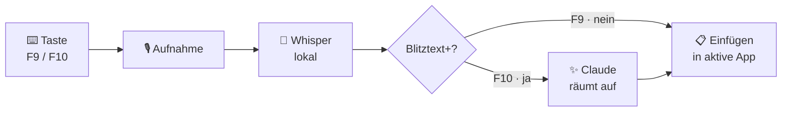

<div align="center">

# ⚡ Blitztext

**Push-to-Talk Diktier-Tool für Windows**

_Drück eine Taste, sprich — und dein Text erscheint dort, wo der Cursor steht._


</div>

---

## Was ist das?

**Blitztext** ist ein kleines Hintergrund-Tool für Windows. Du drückst eine Taste, sprichst, und der erkannte Text wird automatisch in die gerade aktive App eingefügt — E-Mail, Chat, Editor, Browser, egal wo.

Es gibt zwei Modi:

- **Blitztext** _(roh)_ — Spracherkennung läuft **lokal** auf deinem PC (faster-whisper). Schnell, gratis, offline, ohne dass irgendwas deinen Rechner verlässt.
- **Blitztext+** _(aufgeräumt)_ — zusätzlich glättet **Claude** den Rohtext: Grammatik, Zeichensetzung, Füllwörter raus.

---

## So funktioniert's



---

## Features

| | |
|---|---|
| 🎙️ **Lokale Spracherkennung** | faster-whisper, läuft offline auf deinem PC |
| ✨ **KI-Textverbesserung** | optional via Claude (Haiku) |
| ⌨️ **Globale Hotkeys** | funktionieren in jeder App |
| 🔄 **Toggle & Push-to-Talk** | beides, umschaltbar |
| 🟢 **System-Tray** | Status-Icon + Einstellungen |
| 🔴 **Aufnahme-Banner** | sichtbare Anzeige am Bildschirm |
| 🚀 **Autostart** | startet automatisch mit Windows |
| 🔒 **API-Key sicher** | im Windows Credential Manager, nie im Klartext |

---

## Bedienung

| Taste | Funktion |
|:---:|---|
| <kbd>F9</kbd> | Diktat **roh** — lokal, schnell, exakt was du sagst |
| <kbd>F10</kbd> | Diktat **+ Claude** — Text wird aufgeräumt |

Im **Toggle-Modus**: einmal drücken = Aufnahme an, nochmal drücken = aus.
Im **Push-to-Talk-Modus**: Taste halten = Aufnahme, loslassen = fertig.

---

## Installation

```bash
git clone https://github.com/MickVinz/blitztext-windows.git
cd blitztext-windows
pip install -r requirements.txt
python main.py
```

Beim ersten Start lädt das Whisper-Modell automatisch herunter (~40–150 MB, je nach Modell).

**Voraussetzungen:**
- Windows 10 / 11
- Python 3.11 oder neuer
- Ein Mikrofon
- _(optional, nur für Blitztext+)_ ein Claude API-Key von [platform.claude.com](https://platform.claude.com)

---

## Konfiguration

Tray-Icon → Rechtsklick → **Einstellungen**:

| Einstellung | Optionen | Standard |
|---|---|---|
| Aufnahme-Modus | Push-to-Talk / Toggle | Toggle |
| Hotkey Transkription | frei wählbar | <kbd>F9</kbd> |
| Hotkey Verbesserung | frei wählbar | <kbd>F10</kbd> |
| Whisper-Modell | tiny / base / small | tiny |
| Sprache | auto / de / en | de |
| Claude API-Key | — | _(leer)_ |

Tritt eine Änderung sofort in Kraft — kein Neustart nötig.

---

## Architektur

Service-Module mit jeweils einer klaren Aufgabe:

```
blitztext/
├─ main.py              # Orchestrator — verdrahtet alle Services
├─ config.py            # Einstellungen (JSON) + API-Key (Keyring)
├─ services/
│  ├─ audio.py          # Mikrofon-Aufnahme (sounddevice)
│  ├─ transcription.py  # Spracherkennung (faster-whisper)
│  ├─ llm.py            # Textverbesserung (Claude API)
│  ├─ hotkey.py         # globale Hotkeys (PTT + Toggle)
│  └─ paste.py          # Auto-Einfügen (Clipboard + Strg+V)
└─ ui/
   ├─ tray.py           # System-Tray-Icon + Menü
   ├─ settings.py       # Einstellungsfenster (eigener Prozess)
   └─ overlay.py        # Aufnahme-Banner am Bildschirm
```

**Datenfluss:** `Hotkey → audio → transcription → (optional) llm → paste`

---

## Tech-Stack

`faster-whisper` · `anthropic` · `sounddevice` · `keyboard` · `pystray` · `pywin32` · `Pillow` · `keyring`

---

## Credits

Inspiriert von [cmagnussen/blitztext-app](https://github.com/cmagnussen/blitztext-app) (macOS, Swift).
Diese Version ist ein eigenständiger **Windows-Port in Python**.

## Lizenz

[MIT](LICENSE)
